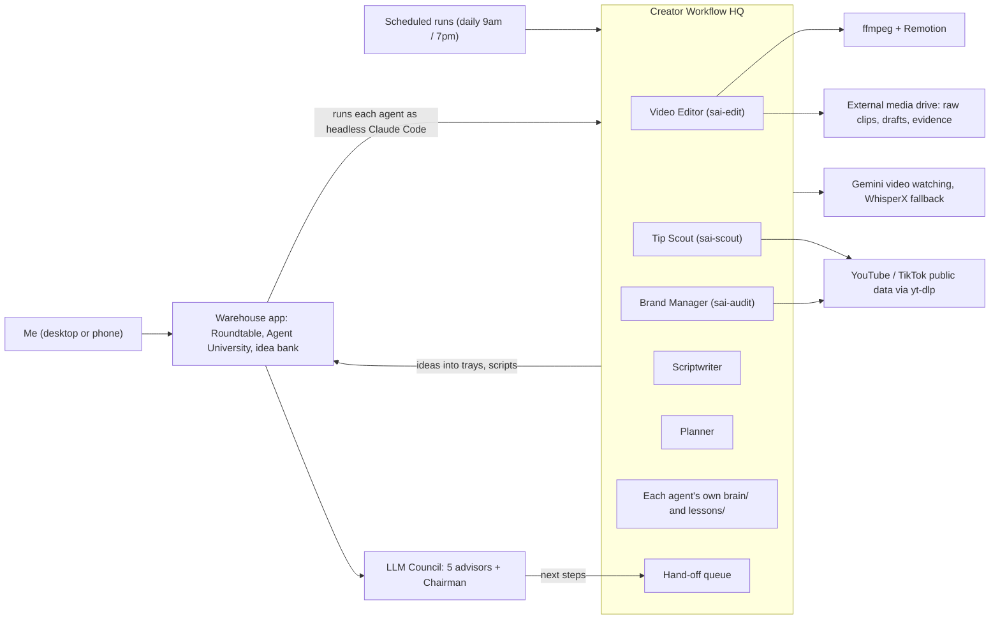
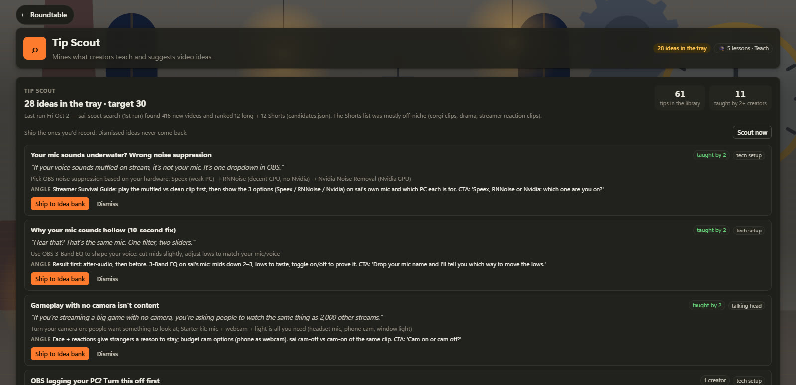
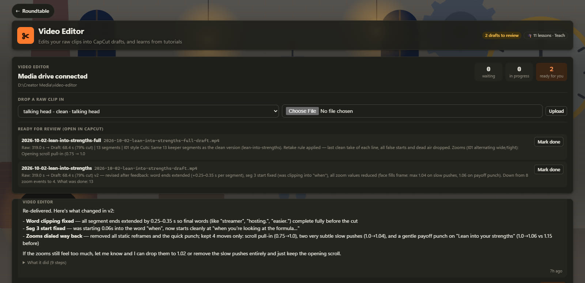
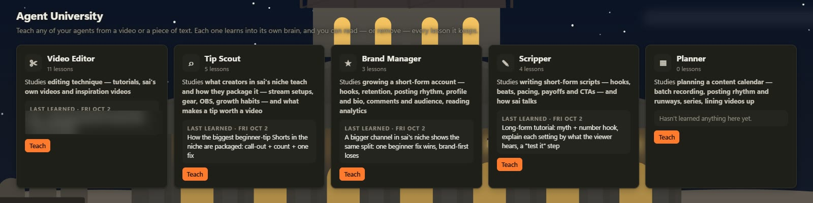

# Creator Workflow HQ

**A team of AI agents, built on Claude Code, that finds video ideas, writes scripts, edits raw footage and audits a short-form video account, with an LLM council above them for decisions.**

> Source code is private — available on request.

## The problem

I make short-form videos on my own: beginner streamer tips and stream setups. Each video means finding an idea, writing a script, recording, cutting out retakes and dead air, then checking what's working on the account. Most of that is repeatable work that takes time away from being on camera. I wanted AI agents that remember my style and what they've learned, work on their own on a schedule, and still leave the final calls to me.

## What it does

- **Video Editor:** learns editing techniques from tutorials and from my own finished videos into its brain, then turns raw clips dropped into a bucket folder into a draft for CapCut. Claude decides the cuts, zooms, motion graphics and sound effects; a Python engine (`sai-edit`) does the work with WhisperX word timestamps, ffmpeg and Remotion. It runs every evening on whatever is waiting.
- **Tip Scout:** each morning it searches YouTube long-form videos and Shorts in my niche, ranks them by outlier score (views ÷ channel subscribers), transcribes them, and pulls every concrete tip into a deduplicated library (61 tips so far, each with a "taught by N creators" count). It turns the strongest tips into video ideas in my voice and puts them in a tray for me to approve.
- **Brand Manager and Scriptwriter:** the Brand Manager audits the account from public data (stats by month and length, hook contact sheets of top vs. weak videos, first spoken lines) and keeps the hook rules. The Scriptwriter writes every video on a confirmed recording day in my voice (exact hook, beats, payoff and call to action), and the script opens on my phone as a teleprompter.
- **LLM Council and Agent University:** five advisors with different angles answer independently, review each other anonymously, and a Chairman gives a verdict whose next steps become tasks for the agents. In Agent University I teach any agent from a video link, an upload or pasted text, and it writes lessons into its own brain.
- **One interface:** everything runs from my companion app, Warehouse, which has a Roundtable page per agent, the idea bank, recording days and a daily debrief, on desktop and phone. A Planner agent adds my own ideas to the next recording day with room.

## Architecture

## Tech stack

- **Claude Code**: agents defined as skills and instruction files, run headless from the Warehouse app and as scheduled routines, each with its own permission rules
- **Python 3.12**: three command-line engines (`sai-edit`, `sai-scout`, `sai-audit`) that do the mechanical steps so the agents never need a general shell
- **ffmpeg / ffprobe**: cutting, zoom keyframes, transitions, color looks, compositing overlays, mixing sound effects
- **WhisperX**: local transcription with word timestamps (edit decisions, tip mining, hook analysis)
- **yt-dlp**: YouTube search and captions, public account stats
- **Remotion (React + TypeScript)**: motion graphics rendered as transparent ProRes overlays
- **Gemini**: watches videos for Agent University and editing lessons, with automatic local fallback
- **Node.js + built-in SQLite**: the Warehouse app and its `wh` command line (idea bank, trays, recording days, debrief)
- **Markdown and JSON** as the agents' long-term memory; **PowerShell** health check; **Telegram** debriefs via Windows Task Scheduler

## My role & the hard parts

I designed and directed the whole system and built it with AI coding agents (Claude Code). My work was the system design: deciding which agents exist and what each one owns, writing the skills and instructions they follow, drawing the permission and safety boundaries, and running each piece as a scoped "goal" with acceptance criteria and live tests before calling it done. Then I iterated on what broke in real use.

- **Least-privilege agents that read untrusted content.** The agents read YouTube transcripts, TikTok comments and pasted text, so a planted instruction must not be able to run anything. Each agent gets a shared deny list plus its own permissions file, and its work goes through narrow engine commands instead of a shell or code runner. Unattended runs are stricter still: no shells, no deleting or moving files, no web requests. Agents can't edit permission files; a change is staged as a proposed file, and I install it after seeing every added or removed rule.
- **Agents that don't step on each other.** Each agent writes only to its own folder. Changing another agent's work goes through a hand-off queue, where rows marked "needs OK" wait for my Yes/No on the Roundtable. The council advises and the agents act. No agent writes to the idea bank: they suggest into trays and I decide what ships.
- **Separating judgment from mechanics.** The model decides what to cut, which tips are new and which hooks work; deterministic Python engines do the rendering, transcription and stats. An edit is a plain cut list that the engine renders, so the result is repeatable and easy to check.
- **Deduplication at three levels.** Every mined video ID is recorded so nothing is mined twice. The same advice from a new creator adds a source to an existing tip and raises its count instead of creating a duplicate. A video idea title the tray has seen before, even one I dismissed, is never suggested again.
- **Graceful degradation across two drives.** Instructions, brains and data live on the main drive; heavy media lives on an external drive. If the drive is unplugged, only editing pauses (the engine exits with a clear "media drive not connected" code) and the scout, audits, scripts and council keep running. A run lock stops two unattended edits from colliding.

## Screenshots

*The Tip Scout's page on the Roundtable: video ideas mined from creators' tips, with "taught by N" counts, waiting for me to ship or dismiss.*

*The Video Editor's page: drop a raw clip in, drafts come back with what was cut and why (79% cut on this one).*

*Agent University: teach any agent from a video or text; each one keeps its own lessons.*

## What I learned / what's next

- **Safety boundaries are part of the design.** Narrow commands, folder ownership and approval queues are what let the agents run unattended without a permissions bypass; when a run hits a refusal, it reports it instead of working around it.
- **Memory has to live in files.** Chat sessions don't carry over, so the system keeps a one-screen handoff, a changelog and a health check script, and a new session or a new Claude account picks up from those.
- **Next:** start edits the moment a clip lands instead of on a schedule, add an automatic pace check on each draft, and keep refining the Scriptwriter's voice guide against audit results.
- **Later:** more agents on the same pattern (marketing, outreach), each with its own brain, permissions and a place in Agent University.
