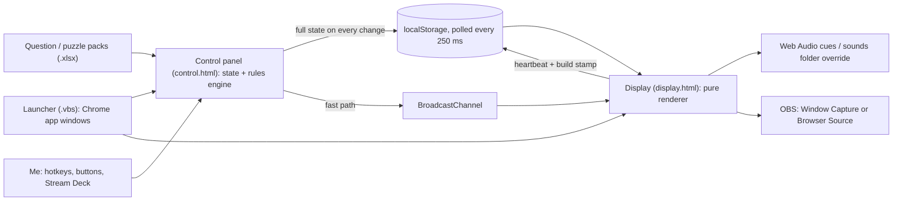

# Game Show Overlays for OBS

**Two browser-based game shows for live streams, inspired by Family Feud and Wheel of Fortune: an operator control panel drives a broadcast-ready game board that OBS captures, with no install, server or build step.**

> Source code is private — available on request.

## The problem

I wanted to host game-show segments with my chat on stream. Running a live game means revealing answers, keeping
score, running clocks and firing sound cues, all while hosting on camera. I needed a board that looks like TV on
stream, a separate panel that only I can see, and a way to run the whole show from the keyboard so I never do math or
hunt for buttons on air.

## What it does

- **Two windows, one show.** A control panel (never on stream) holds the answer key and every control; the display
  page is the board OBS captures, via Window Capture or a transparent Browser Source. A one-click launcher opens both
  as Chrome app windows, the board sized to a 1920x1080 canvas with the bottom of the frame kept clear for my webcam.
- **Survey game (Family Feud style).** Loads question packs from `.xlsx`, deals rounds 7 → 6 → 5 answers → Fast
  Money on one key, numpad reveals, strikes, a steal timer, best-of-three round scoring, a two-player Fast Money round
  against a 200-point target, and celebrations (confetti, a win banner, real-or-joke prize drops).
- **Puzzle game (Wheel of Fortune style).** A 52-tile board, an SVG wheel with 24 wedges that really spins, three
  contestants, and the full show flow (toss-ups, four rounds, a triple toss-up, a speed-up and a bonus round). The rules
  engine does all the money math, and Ctrl+Z undoes up to 40 steps. A built-in pack of 63 original puzzles is included.
- **Keyboard-first operation.** Every action has a hotkey and an on-screen button; hotkeys flash their button, land
  in an action log and are ignored while typing, so they can be bound to a Stream Deck.
- **Sound that streams cleanly.** Every cue (flip, ding, buzzer, sting, time-up, wheel ticks) is synthesized in the
  browser, so the overlay ships with no audio files. Recordings dropped into a `sounds` folder replace them by name,
  with master mute, volume and per-cue switches so it can share the job with a soundboard.

*A non-commercial fan project, not affiliated with or endorsed by Family Feud, Wheel of Fortune or their owners. No
show logos, audio or puzzles are used; all assets are drawn by the page.*

## Architecture

## Tech stack

- **HTML, CSS and vanilla JavaScript** (one self-contained file per page), **SVG** for the wheel and animated characters
- **Web Audio API** for synthesized sound cues, `<audio>` for optional recordings
- **localStorage + BroadcastChannel** for cross-window state sync
- **SheetJS** for in-browser `.xlsx` parsing (nothing is uploaded)
- **VBScript** launcher for Chrome / Edge app mode
- **OBS Studio** (Window Capture, Browser Source, Application Audio Capture)
- **Claude Code** as the coding agent

## My role & the hard parts

I designed and directed both games and built them with AI coding agents (Claude Code). I wrote the specs, including a
detailed goal document with a definition of done for the second game (play a full show on hotkeys only, check 50
spins against the pointer, confirm a reload restores the board), and refined the layout and controls over many
iterations. Writing specs an agent can verify against is the skill this project grew most.

- **Syncing two pages with no server.** Between two local `file://` pages, Chrome shares stored data but does not
  reliably deliver cross-window messages. The control panel pushes its whole state on every change, and the display
  polls it four times a second as the reliable path, with BroadcastChannel as a fast path. The display writes back a
  heartbeat carrying a build stamp, so the panel shows LINKED, lost, or "old build, reload it", and a refreshed OBS
  source restores the exact board. Each game uses its own storage keys, so both can run at once without cross-talk.
- **Messy spreadsheets in, clean boards out.** The loader finds the header anywhere in the first 25 rows, accepts two
  sheet layouts and several header spellings, merges many workbooks, and drops duplicates across files (ignoring case
  and punctuation, keeping the copy with more answers). Questions rotate in shuffled batches of ten, so none repeats
  until the whole deck has been played. Puzzles that cannot fit the 12/14/14/12 board without splitting a word are
  rejected with a reason.
- **Scores that don't change on air.** Survey values are generated, not read: they always add up to exactly 100,
  descend, and never drop below 1. They are seeded from the question text, so reloading a question mid-stream shows
  the same numbers.
- **A wheel you can trust.** The spin is a random push with easing, and the result is computed from where the wheel
  actually stops rather than decided first. One key applies the full rule set (wedge × letters, vowel cost, BANKRUPT,
  the $1,000 solve minimum), and undo snapshots even preserve a running clock's remaining time.

## Screenshots

<!-- screenshot: family-feud-board.png — the survey board on stream with the webcam space below -->
<!-- screenshot: wheel-of-fortune-spin.png — the wheel mid-spin over the puzzle board, with the control panel beside it -->

*Screenshots coming soon.*

## What I learned / what's next

- **Design for the operator, not just the viewer.** A one-key show flow, harmless double-taps and a visible link
  status mattered as much on a live stream as the visuals did.
- **A good reference makes the second build faster.** The second game reused the first one's sync layer, loader and
  habits because I spelled out which patterns to keep and which to change.
- **Next:** my own recorded sound set for the wheel game (the overlay already swaps recordings in by file name), and
  a short demo reel of both games.
