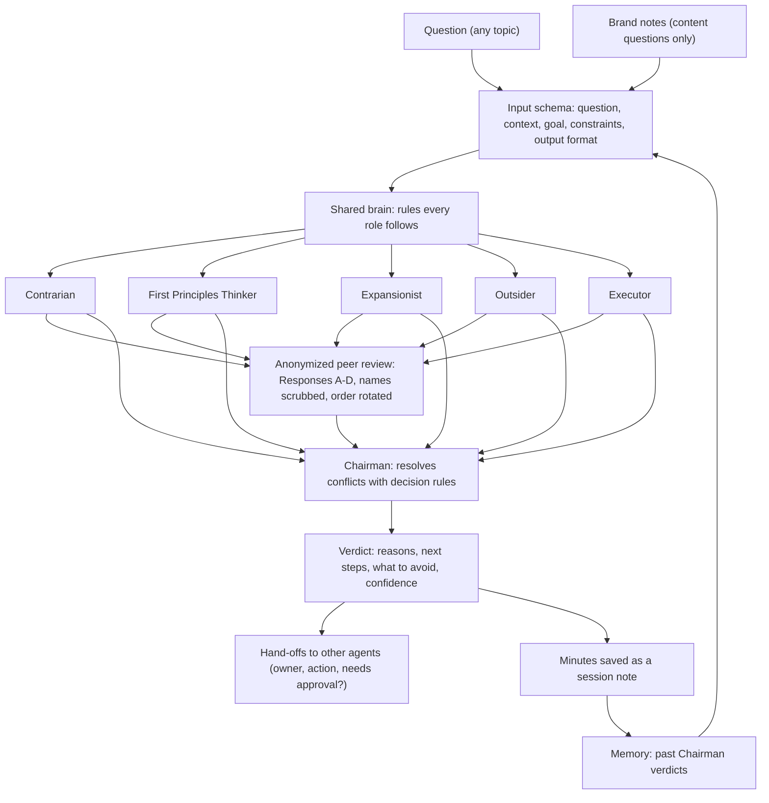

# LLM Council

**A multi-agent decision system: five AI advisors with opposing roles answer a question, review each other anonymously, and a Chairman turns it into a verdict and assigned next steps.**

> Source code is private — available on request.

## The problem

Ask one model a question and you get one perspective, usually an agreeable one, with nobody checking it. It rarely
separates facts from assumptions, it tends to say yes to the plan in front of it, and its advice often ends at
"consider doing X" instead of a concrete step someone owns. I wanted decisions about my projects stress-tested from
several angles, reviewed, and turned into work that actually gets done.

## What it does

- **Five advisors, one question.** A Contrarian (failure modes and hidden costs), a First Principles Thinker (strips the
  problem to what is actually true), an Expansionist (realistic upside and missed opportunities), an Outsider (beginner
  questions that expose jargon and gaps) and an Executor (the next three actions and their dependencies). Each answers
  independently, in its own five-point format.
- **Anonymous peer review.** Every advisor reviews the others as "Response A, B, C…" with names scrubbed out, naming
  each one's strongest point and blind spot and which response the Chairman should weigh most.
- **A Chairman verdict.** The Chairman reads everything, resolves disagreements with explicit decision rules, and returns
  a final verdict, key reasons, what to do next, what to avoid, and a confidence level.
- **Next steps become hand-offs.** Steps that belong to one of my other AI agents become rows in a shared hand-off queue
  (owner, action, and whether it needs my approval first); steps only I can do stay in the verdict.
- **Memory.** Each sitting's minutes are saved back as a session note, and later sittings read earlier verdicts, so the
  council can't quietly contradict a past decision without saying what changed.

## Architecture

The advisors run in parallel. The Chairman is the only step that sees which advisor said what.

## Tech stack

- **Prompt engineering:** role prompts, a shared reasoning layer, an input schema and a synthesis prompt, all plain
  Markdown files (kept as an Obsidian vault), read fresh on every sitting.
- **Claude**, called through the Claude Code CLI or the Anthropic API, with a JSON schema for each stage's output.
- **Node.js** (ES modules, built-in `node:sqlite`): the app that runs sittings in the background and stores their progress.
- **Evaluation:** Markdown scoring criteria and test cases, plus automated tests (`node:test`) with a stand-in model.
- **Claude Code** as my build tool, and for running a sitting by hand with each advisor as its own subagent.

## My role & the hard parts

I designed the council (the roles, the flow, the output formats, the evaluation criteria) and built it with AI coding
agents (Claude Code). My work was the prompt design, the evaluation design, and the orchestration: deciding what each
stage sees, what it must return, and how its output feeds the next stage.

- **Keeping five roles distinct.** "Advisor overlap" is one of the failure modes I score against. Each role has its own
  job and its own five-point output format, and the advisors answer in parallel without seeing each other, so they
  can't drift toward one consensus answer.
- **Making peer review actually anonymous.** Relabeling responses with letters isn't enough on its own, since an advisor's
  text can still give away its role. The app scrubs every advisor name out of the responses and rotates the order for each reviewer,
  while the Chairman still gets the key.
- **Defining what "good" means.** Every run is scored on accuracy, clarity, usefulness, actionability and reasoning
  quality, against named failure modes (hallucination, weak synthesis, too much jargon, no actionable next step,
  advisor overlap), with test cases that state the expected output.
- **Turning a verdict into work.** The Chairman's schema forces each hand-off to name an owner from a fixed list of
  agents and to flag whether it needs my approval, so advice lands in a queue another agent picks up.
- **Failing gracefully.** A sitting continues if a single review fails, stops with a clear error if fewer than two
  advisors answer, and marks itself as cut off if the app restarts mid-sitting.

## Example sitting

*Question:* "Should I build a small desktop tool for my workflow now, or finish the project I already started first?"

- **Advisors:** the Contrarian names what breaks first and the hidden maintenance cost; the First Principles Thinker
  separates the real need from the assumed one; the Expansionist finds the version with the most upside; the Outsider
  asks what the jargon means and spots contradictions; the Executor lists the next three actions.
- **Peer review:** each advisor rates the others' unnamed answers and picks the one the Chairman should weigh most.
- **Chairman:** a verdict (for example, "not yet: validate it cheaply first"), the reasons by advisor, ordered next
  steps, what to avoid, and a confidence level, checked against what earlier sittings already decided.
- **Hand-offs:** any step an agent can do becomes a queued task; the rest stays on my list.

## Screenshots

<!-- screenshot: council-boardroom.png — a council sitting in the app, advisors thinking in parallel -->
<!-- screenshot: council-verdict.png — the Chairman's verdict with next steps and hand-offs -->

*Screenshots coming soon.*

## What I learned / what's next

- Structure beats a clever prompt: fixed output formats per role made the answers comparable and the synthesis much
  easier to check.
- Anonymity has to be enforced in code, not just requested in a prompt: the app strips the names before review.
- Next: turn the Markdown test cases into automated evaluations of real model output, so a change to a role prompt is
  scored before it goes live.
