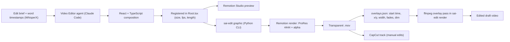

# Motion Studio

**A code-driven motion graphics studio: animated text cards, diagrams and light-leak transitions for my short-form videos, written in React and rendered as transparent video that drops straight onto my edits.**

> Source code is private — available on request.

## The problem

My talking-head videos needed on-screen graphics, such as a key word popping up on the line where I say it, or a
transition flare on a cut. Making these by hand in an editor is slow, hard to keep on-brand, and has to be redone
for every video. I wanted graphics I could describe in plain English, generate as code, re-time to my speech, and
render with a transparent background so they layer cleanly over real footage.

## What it does

- **Eight custom compositions in one Remotion project.** Story graphics (a "two lanes" choice between two options, a
  burst of tilted keyword pills, a two-dot "connection" card), three lower-third style pills and banners, and two
  full-frame vertical light-leak flares (blue and warm) for cut points.
- **One shared brand look.** Dark glass pills, white Montserrat type and a fixed blue / cyan / purple palette,
  defined once and reused, so every graphic matches without me styling it each time.
- **Animation timed to my words.** Each element enters on the second its word is spoken in the draft (the timings
  come from word-level transcript timestamps), with overshoot "pop" easing for entrances and short fades on exit.
- **Transparent output by default.** The render config produces ProRes 4444 `.mov` files with a 10-bit alpha
  channel, so a graphic can sit on top of footage in my automated editor or on a track in CapCut.
- **Rendered by an AI agent.** My Video Editor agent (Claude Code) writes or edits a composition, registers it, and
  renders it with one command (`sai-edit graphic <Id> <out.mov>`); a JSON overlay list then places it on the draft.

## Architecture

## Tech stack

- **Remotion 4** (React-based video rendering) with **React 19** and **TypeScript**
- **@remotion/effects** (light-leak shader) and **@remotion/google-fonts** (Montserrat)
- **Rspack** bundler, **ESLint** + **Prettier**
- **ProRes 4444** (`yuva444p10le`) for transparent output
- **Python** CLI wrapper (`sai-edit`) and **ffmpeg** filter graphs for compositing
- **Claude Code** as the agent that writes, registers and renders compositions

## My role & the hard parts

I designed and directed this project and built it with AI coding agents (Claude Code). I decided what each graphic
should say and look like, set the brand rules, studied editing tutorials to pick the techniques, and reviewed every
render over real footage. Directing agents well, with clear specs, numbered fix lists and checks against real output,
is the skill I used most here.

- **Keeping the alpha channel end to end.** A graphic is only useful if its background stays transparent all the way
  into the edit. The render is pinned to PNG frames, ProRes 4444 and a 10-bit alpha pixel format, and the compositing
  step keeps the alpha through its fades, so the graphic layers cleanly instead of arriving in a black box.
- **Glow halos over footage.** Soft glows that look fine on a checkerboard leave a blurry halo when laid over video.
  I kept the glow on every pill tight and mostly solid, and made "check it over real footage at final size" a rule.
- **Timing graphics to speech.** Each composition works in seconds converted to frames, keyed to the exact word
  timestamps from the draft, so a keyword lands on the beat it is spoken and the next one follows the speech rhythm.
- **Compositions sized to the graphic, not the screen.** Banners render on short 1080-wide canvases, and the editor
  places them with x/y coordinates at compositing time, so one graphic can be reused in different positions. Overlay
  order matters too: light leaks are listed before text so the text stays on top.

## Screenshots

<!-- screenshot: motion-studio-two-lanes.png — the "two lanes" graphic over a talking-head frame -->
<!-- screenshot: motion-studio-remotion-studio.png — Remotion Studio with the composition list -->

*Screenshots coming soon.*

## What I learned / what's next

- **Graphics as code are reusable.** Once the palette and easing live in one place, a new on-brand graphic is a short
  plain-English request to the agent rather than an hour of keyframing.
- **Verify in context.** A render that looks right alone can fail over footage; checking the composited frame caught
  problems that previews missed.
- **Next:** reusable templates fed by props (such as an app-icon pop-up and a notepad-style "series" card) so the
  agent fills in text and timing instead of writing a new composition each time.
