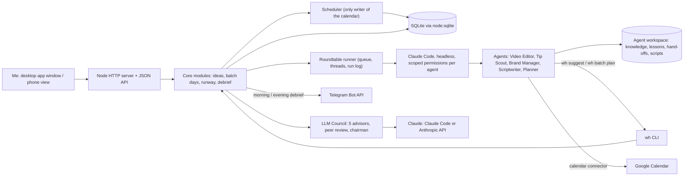
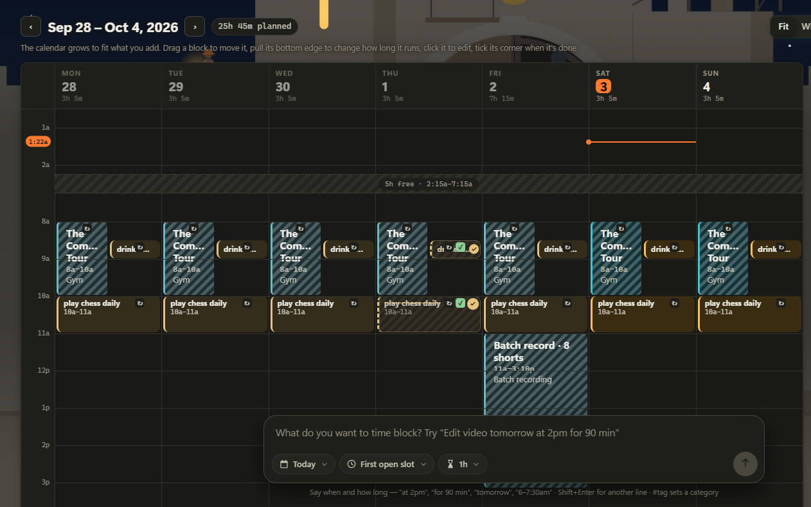
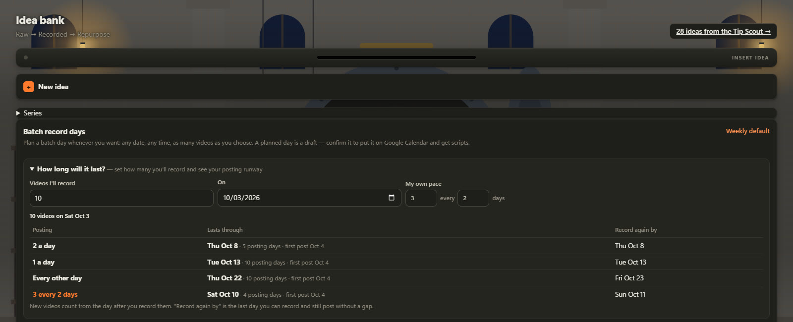

# Warehouse

**A local-first workflow app that runs my content business: it plans my week, manages my video pipeline, and gives me one place to direct a team of AI agents.**

> Source code is private — available on request.

## The problem

I make short-form videos and was running the work out of scattered notes, a separate content planner, a calendar and
several AI agents I could only reach from a terminal. Ideas got lost, recording days were planned by hand, and I had no
honest picture of where my time actually went. I wanted one app, on my own machine, that holds the ideas, turns them
into a plan, and lets me hand work to AI agents without giving them free rein.

## What it does

- **Time-blocks my week.** A chat-style message box reads plain language ("Edit video tomorrow at 2pm for 90 min #editing", "Gym every weekday at 7am"), the calendar scales itself to what's planned, and a side panel totals where the week's time goes by category. Checking a block off asks for proof (a screenshot for video work, a short note otherwise), which feeds day, week and month summaries.
- **Runs the video pipeline.** An idea bank (raw → recorded → repurposed), multi-part series, per-platform repurposing, and batch recording days I plan on any date with their own time and video limit. A "runway" calculator shows how long a batch lasts at different posting paces. Confirmed days sync to Google Calendar, and every video on one gets a script I can read in a scrolling phone teleprompter.
- **The Roundtable: one place to talk to my AI agents.** Five Claude Code agents (Video Editor, Tip Scout, Brand Manager, Scriptwriter, Planner) plus an LLM Council of five advisors with anonymous peer review and a chairman verdict. Each agent has its own page with a resumable conversation, a status card, an idea tray I approve from, and hand-offs waiting for my yes. **Agent University** lets me teach any agent from a video link, an upload or pasted text; it writes lessons into its own knowledge folder.
- **Keeps me posted.** A plain-text debrief (what's done, what needs me) shows on the home page and goes to Telegram every morning and evening.
- **Works from my phone and the terminal.** An installable phone view (passcode-protected, home Wi-Fi or a private Tailscale network) and a `wh` command-line tool with more than 40 commands, which the agents also use to reach the app.

## Architecture

The app itself never talks to Google: the Planner agent syncs confirmed recording days with Claude's calendar tools,
using a plan the app exports, and records each event so the next sync updates it instead of duplicating it.

## Tech stack

- **Node.js 22** (ES modules) using only built-ins: `node:http`, `node:sqlite`, `node:crypto`, `node:test`; no npm dependencies in the core app
- **SQLite** with numbered SQL migrations (22 so far)
- **Vanilla JavaScript, HTML and CSS** front end with hash routing, SVG/CSS animation and a web app manifest for the phone
- **Claude Code** run headless (streamed JSON output, resumable sessions, per-run permission settings); **Anthropic API** as an optional backend with structured output and web search
- **Telegram Bot API**, **Google Calendar** (through Claude's connector), **Tailscale** for private phone access
- **Windows Task Scheduler**, PowerShell and a small launcher that opens the app as its own Chrome window

## My role & the hard parts

I designed and directed Warehouse and built it with AI coding agents (Claude Code). My job was the part that makes
that work: writing precise specs, deciding the rules the system must never break, reviewing every change, testing it
in the real app, and iterating. Each decision is recorded with its reasoning in a running decision log, and the
project's instructions file holds the architectural rules so every new coding session follows them.

- **Flexible scheduling without losing anything.** Recording days can be weekly, one-off, skipped or scrapped, each with its own limit. Videos pinned to a day stay put while the queue fills around them; unrecorded videos roll forward when a day passes; lowering a limit reflows the overflow and raising it pulls videos back. Recorded videos are never moved or dropped, and when no day has room the idea stays in the bank and the app says so instead of hiding it in a queue.
- **Rules enforced by tests, not intentions.** Only the scheduler may write to the calendar table; a test scans the codebase and fails if SQL that writes it appears anywhere else. Calendar blocks owned by other features (recording days, streams, routines) are rebuilt from their source on every change, inside nested transactions.
- **Letting AI agents act without a blank check.** The agents read outside content (video transcripts, comments), so a planted instruction must not be able to run arbitrary commands. Each run gets its own narrow permission set and every other agent's tools are denied; bypass modes are refused by the code; permission changes are staged and only installed after I review a diff. Teaching material is saved to a file and named in the prompt rather than pasted in, so it stays data, never instructions.
- **Background agent runs across processes.** Replies stream their steps into the database while the page polls, each agent keeps one resumable session, and messages sent while an agent is busy wait in a queue. Two real bugs shaped this: a day of seven script requests overflowed the message limit (fixed by sending IDs and letting the agent look details up, splitting into queued parts if needed), and a CLI process wrongly marked a running reply as "cut off" (fixed by making only the server process own live runs).
- **Safe phone access for a local app.** Off by default; the passcode is stored only as a scrypt hash, session tokens are hashed, wrong guesses lock out per address and globally, host headers are checked to block DNS-rebinding pages, and phone access itself can only be changed from the PC. The test suite (207 tests across 27 files) uses stand-ins for Claude and Telegram, so it never spawns an agent or touches the network.

## Screenshots

*Opening Warehouse: the locked gate (drag the key into the padlock). The whole app is drawn as a construction site in SVG/CSS.*

*The week: a self-scaling time-block calendar with the plain-language message box ("Edit video tomorrow at 2pm for 90 min").*

*Batch record days and the runway calculator: how long one recording day lasts at different posting paces.*

## What I learned / what's next

- **Directing AI coding agents is a specification skill.** The quality of the result tracked how clearly I wrote the rules, the edge cases and the "never do this" list, and how carefully I tested before accepting a change.
- **Agents need least privilege, like any other user.** Scoped permissions, a human approval step for hand-offs, and treating every transcript or pasted text as data turned "AI that can act" into something I'm comfortable leaving to run on a schedule.
- **Local-first keeps it simple.** One SQLite file, no accounts and no hosting made it fast to build and easy to back up; the trade-off is that phone access and calendar sync had to be designed carefully.
- **Next:** voice input for brain-dumps (the hook is in place), comparing weeks side by side, and packaging it as a double-click desktop app.
